# Домашнее задание к занятию «Хранение в K8s» Малявко С.Н.

### Задание 1. Volume: обмен данными между контейнерами в поде

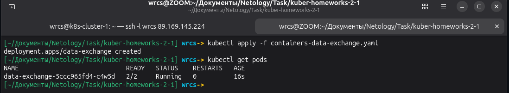
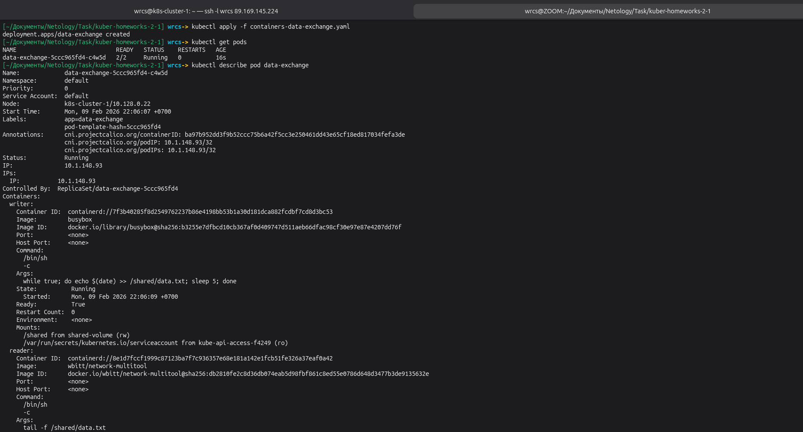
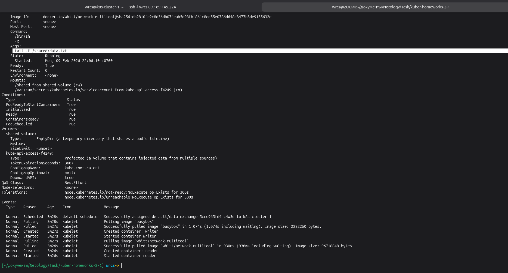
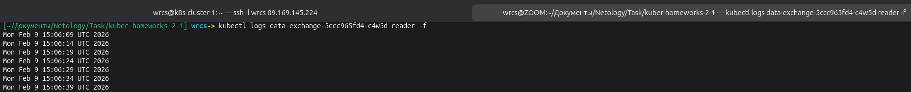

### Задание 2. PV, PVC

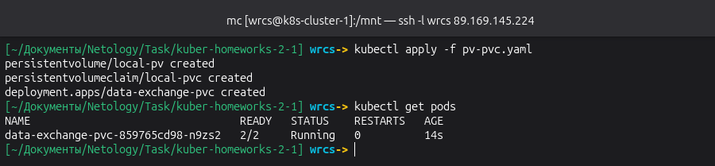
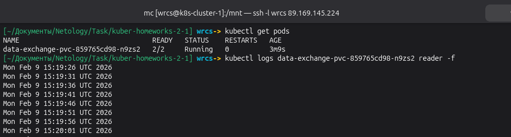
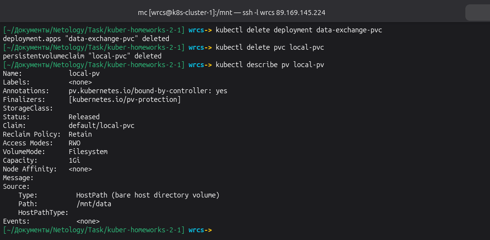
Объяснение: PV останется в статусе Released, потому что reclaimPolicy: Retain. Данные на диске сохранятся.

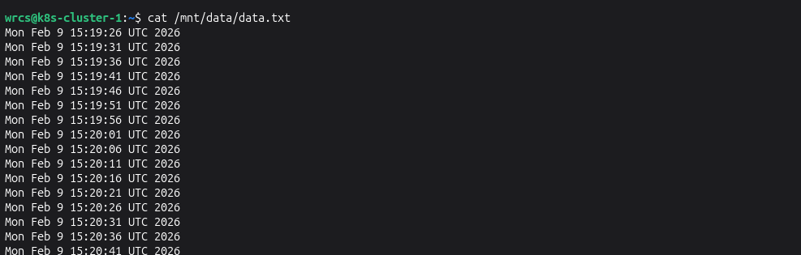
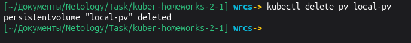
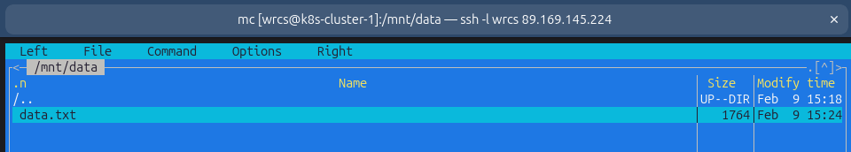
Файл останется на диске, так как PV был удалён из k8s, но данные на хосте не удаляются автоматически.

### Задание 3. StorageClass

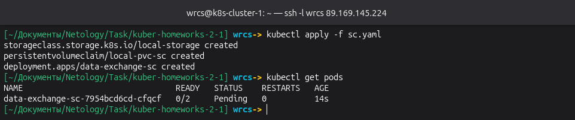
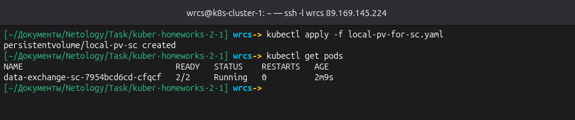
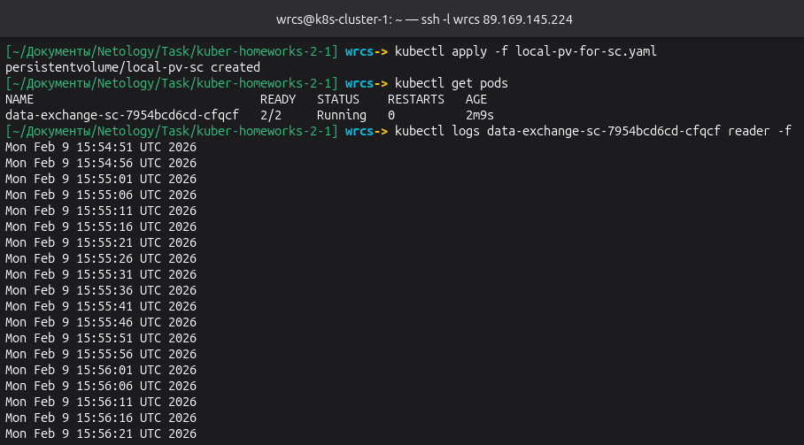

### Файлы манифестов

- [containers-data-exchange.yaml](containers-data-exchange.yaml)
- [pv-pvc.yaml](pv-pvc.yaml)
- [sc.yaml](sc.yaml)
- [local-pv-for-sc.yaml](local-pv-for-sc.yaml)

## ✅ ЗАДАНИЕ ВЫПОЛНЕНО
